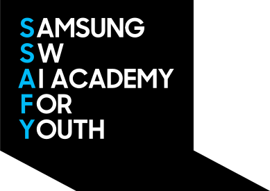

  <strong>mikyudev</strong> / README.md
  

 
 

# Hello! I'm Gyuseong (이규성)

I'm a frontend developer from Korea, building clear UI and natural interactions with a responsible mindset.

 

### About me

-  2025.07 ~ 2026.07 삼성청년SW·AI아카데미 14기
-   React와 TypeScript 기반의 프론트엔드 화면 구현에 집중하고 있습니다.
-  사용자 흐름을 먼저 설계하고, 자연스러운 UI/UX로 연결합니다.
-  AI 연동 기능과 인터랙션 UI를 함께 다루며 화면의 완성도를 높이고자 합니다.
- ⭐ SSAFY 14기 자율 프로젝트에서 우수상을 수상했습니다.
-   발표자료, 목업, 영상 등 결과물을 설득력 있게 보여주는 작업도 경험했습니다.

 

### Stack

  <code></code>
  <code></code>
  <code></code>
  <code></code>
  <code></code>
  <code></code>
  <code></code>
  <code></code>
  <code></code>
  <code></code>

 

### Project timeline

| Project | Type | Period | Role |
| --- | --- | --- | --- |
| [TheComet](https://github.com/mikyudev/TheComet) | SSAFY 14기 관통 프로젝트 | 2025.11.19 ~ 2025.12.25 | 웹 프로젝트 기초 구현 경험 |
| [coordinator](https://github.com/mikyudev/coordinator) | SSAFY 14기 공통 프로젝트 | 2026.01.06 ~ 2026.02.09 | AI 연동, FastAPI, 프론트 일부, Figma, 발표자료 |
| [hyanggi-log](https://github.com/mikyudev/hyanggi-log) | SSAFY 14기 특화 프로젝트 | 2026.02.19 ~ 2026.04.03 | 프론트엔드, UI/UX, Figma, After Effects 영상 제작 |
| [hangyul](https://github.com/mikyudev/hangyul) | SSAFY 14기 자율 프로젝트 · 우수상 | 2026.04.06 ~ 2026.05.27 | 프론트엔드, UI/UX, 리팩토링, 영상 편집 |

 

<a href="https://mikyu-portfolio.vercel.app/">Portfolio</a> · <a href="https://github.com/mikyudev">GitHub</a> · <a href="mailto:1943067@donga.ac.kr">Email</a>